# PSOC&trade; Edge: Advanced voice and audio development training manual

## About this document

This is the lab manual for the PSOC&trade; Edge Advanced voice and audio development training.

## Scope and purpose

In these labs, you will learn how to:

1. Create and run the emUSB-Device Audio Recorder application on KIT_PSE84_EVAL
2. Analyze 16-bit PDM-PCM clipping caused by microphone DC offset
3. Reconfigure the audio path for 24-bit capture and software gain
4. Build, run, and tune the DEEPCRAFT&trade; Audio Enhancement pipeline
5. Use Audacity and AFE configurator to observe, tune, and validate audio behavior

## Intended audience

This manual is intended for embedded developers, application engineers, and technical users working with PSOC&trade; Edge audio and voice workflows.

### Table of contents

- [About this document](#about-this-document)
- [Scope and purpose](#scope-and-purpose)
- [Intended audience](#intended-audience)
- [Table of contents](#table-of-contents)
- [Introduction](#introduction)
- [Required development tools and prerequisites](#required-development-tools-and-prerequisites)
- [Lab 1: Understanding PDM microphone configuration - 16-bit vs 24-bit](#lab-1-understanding-pdm-microphone-configuration---16-bit-vs-24-bit)
- [Lab 2: Hands-on with DEEPCRAFT&trade; Audio Enhancement](#lab-2-hands-on-with-deepcraft-audio-enhancement)
- [Appendix A: Creating a PSOC&trade; Edge application in ModusToolbox&trade;](#appendix-a-creating-a-psoc-edge-application-in-modustoolbox)
- [Appendix B: KIT_PSE84_EVAL details](#appendix-b-kit_pse84_eval-details)
- [Revision history](#revision-history)
- [Disclaimer](#disclaimer)

## Introduction

This lab manual provides advanced, hands-on training for the audio processing capabilities of the Infineon PSOC&trade; Edge E84 MCU. 

The first lab focuses on the low-level PDM-PCM hardware peripheral, exploring the trade-offs between 16-bit and 24-bit configurations to achieve higher dynamic range audio capture.

The second lab transitions to a high-level, real-time audio pipeline, providing practical experience with the DEEPCRAFT&trade; Audio Enhancement middleware.

These labs combine step-by-step instructions with the underlying technical theory so you can diagnose real-world audio artifacts, use PC-based tools for real-time analysis and tuning, and understand the workflows required to optimize audio quality and performance on the PSOC&trade; Edge platform.

## Required development tools and prerequisites

### Tools

#### Hardware

- PSOC&trade; Edge E84 Evaluation Kit - [KIT_PSE84_EVAL](https://www.infineon.com/evaluation-board/kit-pse84-eval)
- 2 x USB-C cables (USB-C to USB-C or USB-C to USB-A)
    - For programming, debugging, and UART communication via the KitProg3 USB connector (J8)
    - For streaming USB Audio Class (UAC) data via the Device USB port (J30)

#### Software

- ModusToolbox&trade; software v3.8 or later
    - Recommended installation via the [ModusToolbox&trade; setup tool](https://softwaretools.infineon.com/tools/com.ifx.tb.tool.modustoolboxsetup)
- Eclipse IDE for ModusToolbox&trade; v2026.3.0 or later
    - Recommended installation via the [ModusToolbox&trade; setup tool](https://softwaretools.infineon.com/tools/com.ifx.tb.tool.modustoolboxsetup)
- Edge Protect Security Suite v1.6 or later
    - Installed by the ModusToolbox&trade; setup tool as a dependency to ModusToolbox&trade;
- ModusToolbox&trade; Programming Tools v1.8.1 or later
    - Installed by the ModusToolbox&trade; setup tool as a dependency to ModusToolbox&trade;
- Board support package (BSP)
    - KIT_PSE84_EVAL_EPC2 v1.0.0 or later, available with ModusToolbox&trade;
- Serial terminal emulator
    - Eclipse IDE for ModusToolbox&trade; includes a serial terminal. Other terminals include Tera Term and PuTTY.
- [Audacity](https://www.audacityteam.org/download/) or a similar audio recording and analysis application
    - Required for audio capture, visualization, and analysis in Labs 1 and 2
- [LLVM for Arm&reg;](https://github.com/ARM-software/LLVM-embedded-toolchain-for-Arm/releases/) v19.1.5 or later if recommended by ModusToolbox&trade;
- [DEEPCRAFT&trade; Audio Enhancement Tech Pack](https://softwaretools.infineon.com/tools/com.ifx.tb.tool.deepcraftaudioenhancementtechpack) v1.2.0 or later
    - Recommended installation via the [ModusToolbox&trade; setup tool](https://softwaretools.infineon.com/tools/com.ifx.tb.tool.modustoolboxsetup)
    - Required for the AFE Configurator workflow used in Lab 2
- Optional: create an account for [DEEPCRAFT&trade; Voice Assistant](https://deepcraft-voice-assistant.infineon.com/)

### Prerequisites

- Install the software and obtain the hardware listed above
- Basic understanding of ModusToolbox&trade; and PSOC&trade; Edge
- Familiarity with audio and voice processing concepts
- Completion of the [Technical Introduction to PSOC&trade; Edge E84 features (E2) training](https://github.com/Infineon/mtb-training-psoc-edge-e84-features) is recommended

For an introduction to PSOC&trade;, including a getting started guide to ModusToolbox&trade;, visit https://www.infineon.com/product-information/psocdeveloper.

For PSOC&trade; Edge trainings, from beginner tutorials to advanced trainings, go to [PSOC&trade; Edge Training Collection](https://infineon-academy.csod.com/samldefault.aspx?ouid=1&returnURL=%252fDeepLink%252fProcessRedirect.aspx%253fmodule%253dphnxdriver%2526routename%253dAdmin%252fPlayerPageRedirectHandler%2526Route%253d%25252flms-learner-playlist%25252fPlaylistDetails%2526Parameters%253dplaylistId%25253d8f04565f-88f4-4ca7-83b3-22e501656fbd).

## Lab 1: Understanding PDM microphone configuration: 16-bit vs 24-bit
<span id="lab-1-understanding-pdm-microphone-configuration---16-bit-vs-24-bit"></span>

## Objective

- To demonstrate the dynamic range limitations of a 16-bit PDM-PCM configuration in the presence of microphone DC offset
- To observe real-time audio clipping as digital gain is increased
- To implement the 24-bit PDM-PCM configuration to resolve the clipping issue and achieve a higher usable dynamic range

## Description

This exercise begins with the default configuration of the USB audio recorder code example, which operates in a 16-bit word size configuration. This code example uses PDM microphones to capture the audio data and stream it over USB to a PC using the USB audio device class. An audio recorder software tool, such as **Audacity**, running on a computer initiates the recording and streaming of audio data. By default, the application is configured to sample stereo audio at 16 kHz sampling rate with 16-bit PCM bit-depth. The sample audio data is eventually transferred to the USB data endpoint buffer.


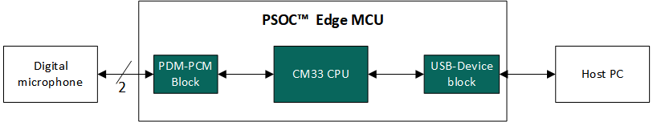

The following are the steps:


1. We will modify this example to add real-time gain control via a terminal. We will then use Audacity to observe the audio waveform, specifically on the left channel, and identify the gain threshold (approximately +29 dB) where signal clipping occurs

2. Users will perform a comprehensive modification of the project. This involves reconfiguring the PDM-PCM peripheral in the Device Configurator for 24-bit output, adding custom FIR filter coefficients, and updating the application code to use a software-based gain and 24-to-16-bit conversion. Finally, we will re-run the experiment to verify that the clipping is eliminated, confirming the superior dynamic range and headroom of the 24-bit pipeline

This code example shows how to record a short audio sample from a microphone, and then play it on a speaker or headphone. The example uses the PDM/PCM block to interface with a digital microphone. All recorded data is stored in the internal SRAM. Once the recording completes, the I2S block starts sending data to an external audio codec TLV320DAC1300. Press the user button on the kit to record an audio sample. When the button is released, it plays back the recorded audio when the button was pressed.

## Technical Background: PDM, PCM, and dynamic range

### The PDM-PCM conversion pipeline

The PSOC&trade; Edge MCU acquires audio from the onboard digital microphones as a Pulse Density Modulation (PDM) signal. PDM is a 1-bit, high-sample-rate digital format. For processing, this must be converted to Pulse-Code Modulation (PCM), which is a multi-bit, lower-sample-rate format (for example, 16-bit at 16 kHz). This conversion is handled by the PDM-PCM hardware IP block, which uses a series of decimation filters, including a Cascaded Integrator Comb (CIC) filter, two Finite Impulse Response (FIR) filters, and a DC blocking filter, to reduce the sampling rate and increase the word length.

### Understanding bit depth and dynamic range

The dynamic range in digital audio represents the difference between the loudest possible signal (before clipping) and the quietest signal (the noise floor). Bit depth is the primary determinant of dynamic range. A 16-bit PCM signal provides a theoretical dynamic range of 96 dB, while 24-bit PCM provides 144 dB. While 96 dB is sufficient for many applications, it assumes the entire 16-bit range is usable.

### 16-bit clipping anomaly: A technical deep dive

A critical scenario arises in the default 16-bit configuration that demonstrates this lab's core concept.

With the default 16-bit configuration, setting gain value greater than 29 dB will cause clipping of audio data in left channel. This clipping occurs for a specific technical reason. The IM7\* series microphone on the left channel has a physical characteristic, an "unequal DC offset", that shifts its baseline signal level away from zero. This DC offset effectively consumes a portion of the available 16-bit headroom.

When the hardware PDM-PCM gain (applied via the` Cy_PDM_PCM_SetGain()` API) is increased, it amplifies **both** the desired AC audio signal and this unwanted DC offset. At a gain level of +29 dB (`CY_PDM_PCM_SEL_GAIN_29DB`) or higher, the amplified DC offset plus the incoming audio signal exceeds the maximum value that can be represented by a 16-bit signed integer, causing the signal to be "clipped" at its positive or negative limit. This clipping is an irreversible loss of audio information.

The solution is to capture the audio at a higher bit depth (24-bit), which provides 144 dB of headroom. This extra headroom is more than enough to accommodate the DC offset **and** the audio signal. We can then apply gain in **software** (post-decimation) before converting the signal down to 16-bit for the remaining audio pipeline. This lab implements this exact solution.

## Audio data flow

The data flow for the initial 16-bit configuration is as follows:

1. Audio is captured by the PDM microphones
2. The PDM signal is fed to the PDM-PCM IP block, which is configured for 16-bit output. The hardware gain is applied
3. The 16-bit PCM samples are read by the CM33 CPU via an interrupt
4. The CM33 CPU transfers the 16-bit PCM data to the USB-device block
5. The USB block streams the audio data to the host PC, which is received by Audacity as a microphone (USB audio recorder)


## Project creation

1. Follow steps 1-4 in [Appendix A: Creating a PSOC&trade; Edge application in ModusToolbox&trade;](#appendix-a-creating-a-psoc-edge-application-in-modustoolbox) to create a new application
2. When creating the application, select the **PSOC&trade; Edge emUSB-Device Audio Recorder** application under the **Peripherals** section

> **Note:** To prevent issues with Windows path length, it is recommended to rename the project if your workspace path is long.

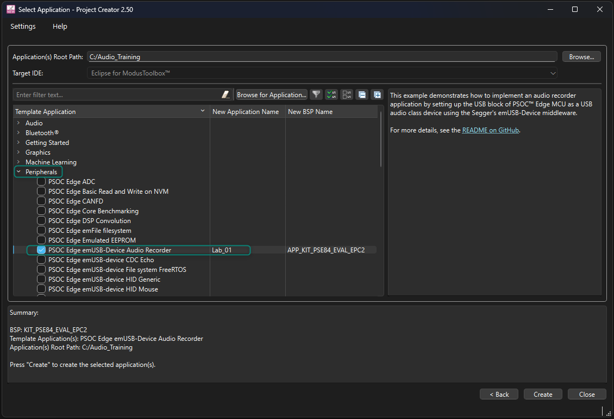


3. Once created, build and program the application

## Exercise 1: Observing clipping in 16-bit configuration

### Hardware connection and audacity setup

1. Connect the first USB cable from your PC to the **KitProg3 USB connector (J8)** and the second USB cable to the **Device USB connector (J30)** of the evaluation kit as shown in the following figure

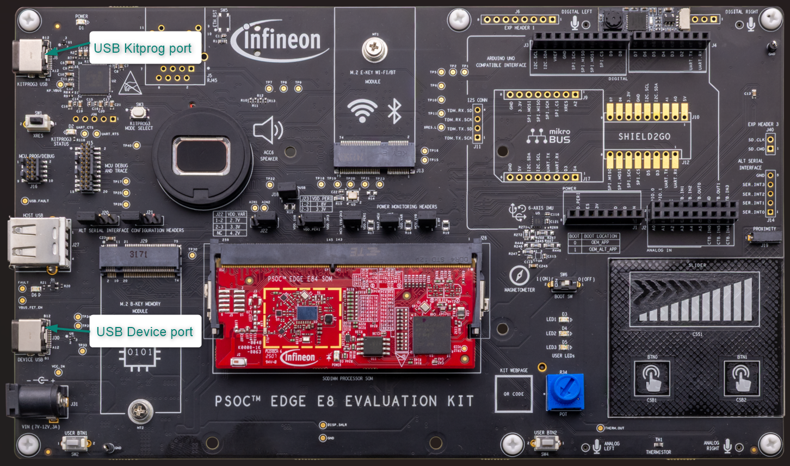


2. Open **Tera Term** or any other serial terminal program and connect to the KitProg3 COM port. Use serial settings **115200** baud, and **8N1**
3. The terminal will display the message **PSOC Edge MCU: Audio recorder using emUSB-device**
4. Verify that Windows has successfully enumerated the device. In *Control Panel > Sound*, you should see a new recording device named **Audio Control**

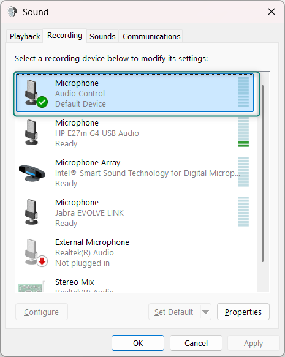


5. Open **Audacity**
6. In the device toolbar, set the Audio Host to **MME**, the recording device to **Microphone (Audio Control)**, and the recording channels to **2 (Stereo)**.  
> **Note:** Click *View -> Toolbars -> Device Toolbar* if the toolbar is not enabled by default

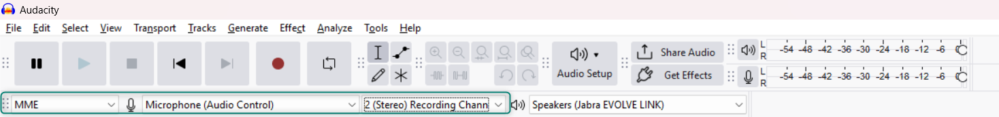


7. Click the **Record** button. Speak into the microphones (located on the upper right corner of the kit as shown in [KIT_PSE84_EVAL details](#appendix-b-kit_pse84_eval-details)) and verify that you see a stereo waveform being captured


### Modify the application: add gain control

In this lab, we will use an audio sampling rate of 16 kHz, which is the standard rate for most voice applications. 

1. Set the sampling rate by editing **AUDIO_IN_SAMPLE_FREQ** in *proj_cm33_ns/include/audio.h* file
> **Note**: the diff code blocks use `+` and `-` to highlight modifications throughout this document. Modify the corresponding lines in your application.

```diff
/* USB Audio IN Endpoint configuration data */
#define AUDIO_IN_NUM_CHANNELS (2U)
#define AUDIO_IN_SUB_FRAME_SIZE (2U) /* In bytes */
#define AUDIO_IN_BIT_RESOLUTION (16U)
+#define AUDIO_IN_SAMPLE_FREQ AUDIO_SAMPLING_RATE_16KHZ  // <-- update
```

2. In order to observe the clipping artifact, we need to disable the DC blocking filter. Otherwise, the clipped audio will be completely nullified by the DC blocking filter producing zero output at higher gain values. Open the *proj_cm33_ns/source/audio_in.c* file and disable DC blocking filter by updating the **pdm_pcm_channel_2_config** and **pdm_pcm_channel_3_config** structures are highlighted in green in the following code

```diff
const cy_stc_pdm_pcm_channel_config_t pdm_pcm_channel_2_config =
{
    ...
#elif(AUDIO_IN_SAMPLE_FREQ == AUDIO_SAMPLING_RATE_44KHZ)
    .cic_decim_code  = CY_PDM_PCM_CHAN_CIC_DECIM_16,
    .fir1_decim_code = CY_PDM_PCM_CHAN_FIR1_DECIM_2,
    .fir1_scale = 5,
#endif
+    .dc_block_disable = true,   // <-- update
    .dc_block_code = CY_PDM_PCM_CHAN_DCBLOCK_CODE_16,
};
const cy_stc_pdm_pcm_channel_config_t pdm_pcm_channel_3_config =
{
    ...
#elif(AUDIO_IN_SAMPLE_FREQ == AUDIO_SAMPLING_RATE_44KHZ)
    .cic_decim_code  = CY_PDM_PCM_CHAN_CIC_DECIM_16,
    .fir1_decim_code = CY_PDM_PCM_CHAN_FIR1_DECIM_2,
    .fir1_scale = 5,
#endif
+    .dc_block_disable = true,   // <-- update
    .dc_block_code = CY_PDM_PCM_CHAN_DCBLOCK_CODE_16,
};
```

3. In the same file, add the below function definition above the `audio_in_init()` function
> **Note**: C code blocks used throughout the document use C syntax and can be copy-pasted directly to the application.

```c
/* <-- Add this function --> */
void audio_gain_control_task(void *arg)
{
    CY_UNUSED_PARAMETER(arg);
    cy_en_pdm_pcm_gain_sel_t current_scale = CY_PDM_PCM_SEL_GAIN_5DB;
    /* Set initial gain */
    Cy_PDM_PCM_SetGain(CYBSP_PDM_HW, LEFT_CH_INDEX, current_scale);
    Cy_PDM_PCM_SetGain(CYBSP_PDM_HW, RIGHT_CH_INDEX, current_scale);
    printf("Gain: Scale Value = %d\r\n", current_scale);
    for (;;)
    {
        uint32_t num_available = 0;
        /* Check if any characters are available in UART RX FIFO (non-blocking) */
        num_available = Cy_SCB_UART_GetNumInRxFifo(CYBSP_DEBUG_UART_HW);
        if (num_available > 0)
        {
            /* Read character from UART */
            uint32_t read_value = Cy_SCB_UART_Get(CYBSP_DEBUG_UART_HW);
            if (read_value != CY_SCB_UART_RX_NO_DATA)
            {
                char received_char = (char)read_value;
                bool gain_changed = false;
                if (received_char == 'u')
                {
                    /* Increase gain */
                    if (current_scale > CY_PDM_PCM_SEL_GAIN_83DB)
                    {
                        current_scale --;
                        gain_changed = true;
                    }
                    else
                    {
                        printf("Already at maximum gain!\r\n");
                    }
                }
                else if (received_char == 'd')
                {
                    /* Decrease gain */
                    if (current_scale < CY_PDM_PCM_SEL_GAIN_NEGATIVE_103DB)
                    {
                        current_scale ++;
                        gain_changed = true;
                    }
                    else
                    {
                        printf("Already at minimum gain!\r\n");
                    }
                }
                if (gain_changed)
                {
                    /* Apply new gain to both channels */
                    Cy_PDM_PCM_SetGain(CYBSP_PDM_HW, LEFT_CH_INDEX, current_scale);
                    Cy_PDM_PCM_SetGain(CYBSP_PDM_HW, RIGHT_CH_INDEX, current_scale);
                    printf("Gain: Scale value = %d\r\n", current_scale);
                }
            }
        }
        /* Small delay to avoid busy-waiting and allow other tasks to run */
        vTaskDelay(pdMS_TO_TICKS(100));
    }
}   /* <-- End of added function --> */
```

4. In the `audio_in_init()` function add the FreeRTOS task creation code highlighted in green in the below code

```diff
void audio_in_init(void)
{
    ...

    /* Create the AUDIO Write RTOS task */
    rtos_task_status = xTaskCreate(audio_in_process, "Audio In Task", AUDIO_TASK_STACK_DEPTH, NULL,
            AUDIO_WRITE_TASK_PRIORITY, &rtos_audio_in_task);
    if (pdPASS != rtos_task_status)
    {
        handle_app_error();
    }

+	/** <-- Add code to create task --> **/
+	/* Create the Audio Gain Control RTOS task with lower priority */
+    rtos_task_status = xTaskCreate(audio_gain_control_task, "Gain Control Task", 512u, NULL, 1u, NULL);
+    if (pdPASS != rtos_task_status)
+    {
+        handle_app_error();
+    }   /** <-- End of added code to create task --> **/
}
```

5. *[Info]* In the newly added **audio_gain_control_task()** task, the PDM gain is dynamically controlled using the **Cy_PDM_PCM_SetGain()** API. This PDL API’s last argument is an enum **cy_en_pdm_pcm_gain_sel_t** that maps scale values (0-31) to decibel (dB) levels, as shown in the following table

| **Enum value** | **Gain (dB)** | **Scale value** |
| --- | --- | --- |
| CY_PDM_PCM_SEL_GAIN_83DB | 83 dB | 0 |
| CY_PDM_PCM_SEL_GAIN_77DB | 77 dB | 1 |
| CY_PDM_PCM_SEL_GAIN_71DB | 71 dB | 2 |
| CY_PDM_PCM_SEL_GAIN_65DB | 65 dB | 3 |
| CY_PDM_PCM_SEL_GAIN_59DB | 59 dB | 4 |
| CY_PDM_PCM_SEL_GAIN_53DB | 53 dB | 5 |
| CY_PDM_PCM_SEL_GAIN_47DB | 47 dB | 6 |
| CY_PDM_PCM_SEL_GAIN_41DB | 41 dB | 7 |
| CY_PDM_PCM_SEL_GAIN_35DB | 35 dB | 8 |
| CY_PDM_PCM_SEL_GAIN_29DB | 29 dB | 9 |
| CY_PDM_PCM_SEL_GAIN_23DB | 23 dB | 10 |
| CY_PDM_PCM_SEL_GAIN_17DB | 17 dB | 11 |
| CY_PDM_PCM_SEL_GAIN_11DB | 11 dB | 12 |
| CY_PDM_PCM_SEL_GAIN_5DB | 5 dB | 13 |
| CY_PDM_PCM_SEL_GAIN_NEGATIVE_1DB | -1 dB | 14 |
| CY_PDM_PCM_SEL_GAIN_NEGATIVE_7DB | -7 dB | 15 |
| CY_PDM_PCM_SEL_GAIN_NEGATIVE_13DB | -13 dB | 16 |
| CY_PDM_PCM_SEL_GAIN_NEGATIVE_19DB | -19 dB | 17 |
| CY_PDM_PCM_SEL_GAIN_NEGATIVE_25DB | -25 dB | 18 |
| CY_PDM_PCM_SEL_GAIN_NEGATIVE_31DB | -31 dB | 19 |
| CY_PDM_PCM_SEL_GAIN_NEGATIVE_37DB | -37 dB | 20 |
| CY_PDM_PCM_SEL_GAIN_NEGATIVE_43DB | -43 dB | 21 |
| CY_PDM_PCM_SEL_GAIN_NEGATIVE_49DB | -49 dB | 22 |
| CY_PDM_PCM_SEL_GAIN_NEGATIVE_55DB | -55 dB | 23 |
| CY_PDM_PCM_SEL_GAIN_NEGATIVE_61DB | -61 dB | 24 |
| CY_PDM_PCM_SEL_GAIN_NEGATIVE_67DB | -67 dB | 25 |
| CY_PDM_PCM_SEL_GAIN_NEGATIVE_73DB | -73 dB | 26 |
| CY_PDM_PCM_SEL_GAIN_NEGATIVE_79DB | -79 dB | 27 |
| CY_PDM_PCM_SEL_GAIN_NEGATIVE_85DB | -85 dB | 28 |
| CY_PDM_PCM_SEL_GAIN_NEGATIVE_91DB | -91 dB | 29 |
| CY_PDM_PCM_SEL_GAIN_NEGATIVE_97DB | -97 dB | 30 |
| CY_PDM_PCM_SEL_GAIN_NEGATIVE_103DB | -103 dB | 31 |

### Real-time observation of clipping

1. Build and flash the modified **proj_cm33_ns** application
2. Start recording in Audacity
3. Play any continuous audio like a sine tone near the kit’s PDM microphones
4. Observe the Audacity waveform and notice the audio amplitude for the gain value you set in the code. The default value for gain in scale is 13 that maps to 5 dB
5. Increase the gain by pressing the **"u"** key in the serial terminal. Observe the message **Gain: Scale value = 12**, indicating that the scale value has decreased and the gain has increased

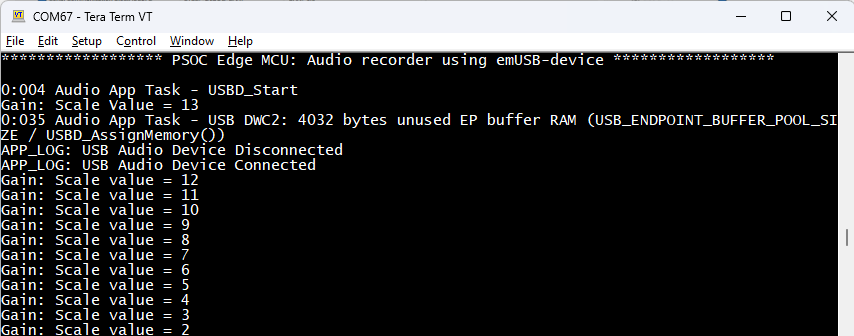


You can also observe the audio amplitude increase in the audio recording on Audacity. Repeat this step for other gain values.

Additionally, you can decrease the gain by pressing the **"d"** key.

6. Notice that as the scale value decreases below ~7-9 (29 dB – 41 dB), the top waveform begins to flatten at the top. This is audio clipping. The bottom waveform will likely still have headroom. This is indicated in the below figure

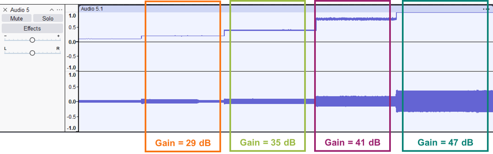

7. Due to audio clipping, the audio signal will be unusable for any application. The exact clipping thresholds may vary depending on the audio source and the distance between the source and the microphones. However, with the 16-bit configuration, clipping occurs prematurely, especially on one of the channels. This confirms the behavior described in the technical background

With this behavior, when the DC blocking filter is enabled, the output at higher gain levels (such as 47 dB) can be zero because the audio is fully clipped. Therefore, the effective PCM range must be improved before applying the DC blocking filter. This is done using the 24-bit PDM configuration described in the next section.

## Exercise 2: Reconfiguring for 24-bit high dynamic range

Now, we will modify the project to fix the clipping issue.

### Modifying the application code

1. Open **Device Configurator** and change the following **PDM0** parameters.
This application overrides these changes in code because we will modify source code directly in subsequent steps; however, you may refer to the following information for any other application configuring PDM microphones using the Device Configurator

| PDM0 parameter | Value |
| --- | --- |
| Channel 2 Config - Word size | 24 |
| Channel 2 Config - FIR0 scale | 16 |
| Channel 3 Config - Word size | 24 |
| Channel 3 Config - FIR0 scale | 16 |
| PDM Config - User Configure FIR0 | Enable |
| PDM Config - User Configure FIR1 | Enable |

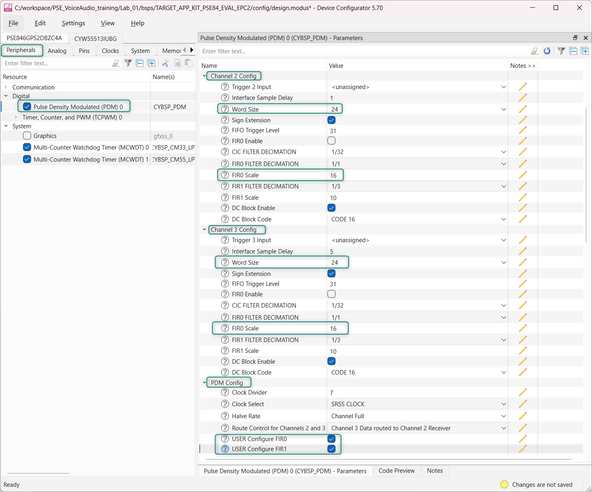

2. Add the FIR coefficients

| FIR0 coefficient | Data [0:1] | FIR1 coefficient | Data [0:1] |
| --- | --- | --- | --- |
| FIR0 Coeff0 | 5, 12 | FIR1 Coeff0 | 190, 258 |
| FIR0 Coeff1 | -2, -57 | FIR1 Coeff1 | -106, -87 |
| FIR0 Coeff2 | -106, -23 | FIR1 Coeff2 | 16, 169 |
| FIR0 Coeff3 | 245, 466 | FIR1 Coeff3 | -35, -182 |
| FIR0 Coeff4 | 202, -684 | FIR1 Coeff4 | -5, 226 |
| FIR0 Coeff5 | -1509, -1005 | FIR1 Coeff5 | 40, -261 |
| FIR0 Coeff6 | 1566, 5357 | FIR1 Coeff6 | -97, 300 |
| FIR0 Coeff7 | 8191, 8191 | FIR1 Coeff7 | 173, -336 |
|  |  | FIR1 Coeff8 | -276, 369 |
|  |  | FIR1 Coeff9 | 418, -398 |
|  |  | FIR1 Coeff10 | -630, 422 |
|  |  | FIR1 Coeff11 | 986, -439 |
|  |  | FIR1 Coeff12 | -1764, 450 |
|  |  | FIR1 Coeff13 | 5480, 8191 |

<div style="display:flex; gap:16px; justify-content:center; align-items:flex-start; flex-wrap:nowrap;">
  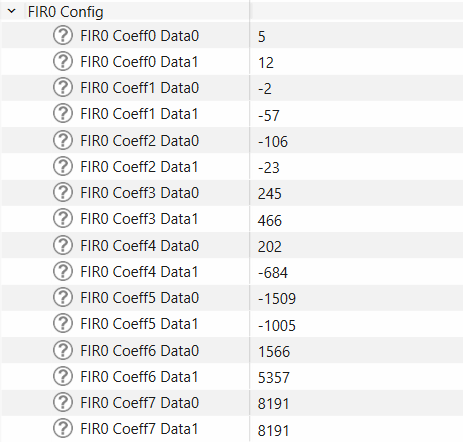
  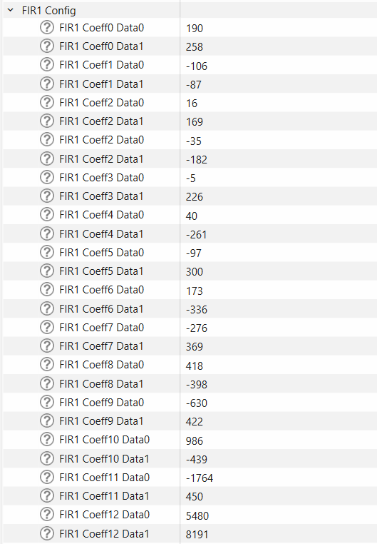
</div>


3. Open *proj_cm33_ns/source/audio_in.c* and add the following global variable and structure

```c
/*****************************************************************************
* Global Variables
*****************************************************************************/
static int32_t sw_gain = 0; 	/*<-- Add global variable -->*/

/**  <-- Add structure --> **/
const cy_stc_pdm_pcm_config_v2_t CYBSP_PDM_config_24_bit =
{
    .clkDiv = 7,
    .clksel = CY_PDM_PCM_SEL_SRSS_CLOCK,
    .halverate = CY_PDM_PCM_RATE_FULL,
    .route = 4,
    .fir0_coeff_user_value = true,
    .fir1_coeff_user_value = true,
    .fir0_coeff = {{5, 12}, {-2, -57}, {-106, -23}, {245, 466}, {202, -684}, 
                   {-1509, -1005}, {1566, 5357}, {8191, 8191} },
    .fir1_coeff = {{190, 258}, {-106, -87}, {16, 169}, {-35, -182}, {-5, 226},
                   {40, -261}, {-97, 300}, {173, -336}, {-276, 369}, {418, -398},
                   {-630, 422}, {986, -439}, {-1764, 450}, {5480, 8191} },
}; /**  <-- End of added structure --> **/
```
`CYBSP_PDM_config_24_bit` is configuring the coefficients directly in code, instead of using Device Configurator, and `sw_gain` will be used to adjust the gain in software.

4. Open *proj_cm33_ns/source/audio_in.c* and modify the structure members as highlighted in the following code

```diff
const cy_stc_pdm_pcm_channel_config_t pdm_pcm_channel_2_config =
{
    .sampledelay = 1,
+    .wordSize = CY_PDM_PCM_WSIZE_24_BIT,    // <-- update
    .signExtension = true,
    .rxFifoTriggerLevel = 31,
    .fir0_enable = true,  // <-- update
+    .fir0_decim_code = CY_PDM_PCM_CHAN_FIR0_DECIM_3, // <-- update
    .fir0_scale = 16,  // <-- update
#if (AUDIO_IN_SAMPLE_FREQ == AUDIO_SAMPLING_RATE_16KHZ)
+    .cic_decim_code  = CY_PDM_PCM_CHAN_CIC_DECIM_16,  // <-- update
+    .fir1_decim_code = CY_PDM_PCM_CHAN_FIR1_DECIM_2, // <-- update
    .fir1_scale = 4, // <-- update
#elif(AUDIO_IN_SAMPLE_FREQ == AUDIO_SAMPLING_RATE_32KHZ)
...
#endif
+    .dc_block_disable = false, // <-- update
    .dc_block_code = CY_PDM_PCM_CHAN_DCBLOCK_CODE_16,
};

const cy_stc_pdm_pcm_channel_config_t pdm_pcm_channel_3_config =
{
    .sampledelay = 5,
+   .wordSize = CY_PDM_PCM_WSIZE_24_BIT,  // <-- update
    .signExtension = true,
    .rxFifoTriggerLevel = 31,
    .fir0_enable = true, // <-- update
+    .fir0_decim_code = CY_PDM_PCM_CHAN_FIR0_DECIM_3, // <-- update
    .fir0_scale = 16, // <-- update
#if (AUDIO_IN_SAMPLE_FREQ == AUDIO_SAMPLING_RATE_16KHZ)
+    .cic_decim_code  = CY_PDM_PCM_CHAN_CIC_DECIM_16, // <-- update
+    .fir1_decim_code = CY_PDM_PCM_CHAN_FIR1_DECIM_2, // <-- update
    .fir1_scale = 4, // <-- update
#elif(AUDIO_IN_SAMPLE_FREQ == AUDIO_SAMPLING_RATE_32KHZ)
...
#endif
+    .dc_block_disable = false,  // <-- update
    .dc_block_code = CY_PDM_PCM_CHAN_DCBLOCK_CODE_16,
};
```

Note that the DC blocking filter is enabled in this case. Because the effective PCM range is improved with the 24-bit configuration, the audio no longer clips at high gain values at the input of the DC blocking filter. Therefore, the DC blocking filter can remain enabled without the audio being nullified at higher gain values.

5. In the same *proj_cm33_ns/source/audio_in.c* file, update the `audio_gain_control_task()` function. Delete the lines highlighted in red, and add the lines in green

```diff
void audio_gain_control_task(void *arg)
{
    CY_UNUSED_PARAMETER(arg);
+	/** <-- Delete lines corresponding to 16-bit configuration  --> **/
-	cy_en_pdm_pcm_gain_sel_t current_scale = CY_PDM_PCM_SEL_GAIN_5DB;
-	/* Set initial gain */
-	Cy_PDM_PCM_SetGain(CYBSP_PDM_HW, LEFT_CH_INDEX, current_scale);
-	Cy_PDM_PCM_SetGain(CYBSP_PDM_HW, RIGHT_CH_INDEX, current_scale);
-	printf("Gain: Scale Value = %d\r\n", current_scale);

    for (;;)
    {
        uint32_t num_available = 0;
        /* Check if any characters are available in UART RX FIFO (non-blocking) */
        num_available = Cy_SCB_UART_GetNumInRxFifo(CYBSP_DEBUG_UART_HW);
        if (num_available > 0)
        {
            /* Read character from UART */
            uint32_t read_value = Cy_SCB_UART_Get(CYBSP_DEBUG_UART_HW);
            if (read_value != CY_SCB_UART_RX_NO_DATA)
            {
                char received_char = (char)read_value;
                bool gain_changed = false;
                if (received_char == 'u')
                {
                    /* Increase gain */
+					/** <-- Modify routine -->**/
+                    if (sw_gain < 40)
                    {
+                        sw_gain ++;
                        gain_changed = true;
+                    } /** <-- End of modified routine -->**/
                    else
                    {
                        printf("Already at maximum gain!\r\n");
                    }
                }
                else if (received_char == 'd')
                {
                    /* Decrease gain */
+					/** <-- Modify routine -->**/
+                    if (sw_gain > -40)
                    {
+                        sw_gain --;
                        gain_changed = true;
+                    } /** <-- End of modified routine -->**/
                    else
                    {
                        printf("Already at minimum gain!\r\n");
                    }
                }
                if (gain_changed)
                {
+					/**<-- Replace routine -->**/ 
-	                /* Apply new gain to both channels */
-					Cy_PDM_PCM_SetGain(CYBSP_PDM_HW, LEFT_CH_INDEX, current_scale);
-					Cy_PDM_PCM_SetGain(CYBSP_PDM_HW, RIGHT_CH_INDEX, current_scale);
-					printf("Gain: Scale value = %d\r\n", current_scale);
+					printf("Gain: SW Gain value = %d\r\n", sw_gain);
+					/**<-- End of replaced routine -->**/
                }
            }
        }
        /* Small delay to avoid busy-waiting and allow other tasks to run */
        vTaskDelay(pdMS_TO_TICKS(100));
    }
}
```

6. Update the `audio_in_init()` function to use the new 24-bit PDM configuration structure as shown in the following code

```diff
void audio_in_init(void)
{
    BaseType_t rtos_task_status;

    /* Initialize PDM/PCM block */
+   /** Replace initialization routine **/
+   cy_en_pdm_pcm_status_t status = Cy_PDM_PCM_Init(CYBSP_PDM_HW, &CYBSP_PDM_config_24_bit);  
+	/**<-- End of replaced initialization routine -->**/
    ...
}
```

7. The hardware now delivers 24-bit samples, but the USB stack still expects 16-bit samples. We must add the conversion step. We must call `Cy_PDM_PCM_ApplyPCM_Gain()` to apply software gain and convert the 24-bit data to 16-bit **before** passing it to the USB buffer. This function will take the 24-bit data from `pdm_interim_buffer`, apply a software gain, and write the 16-bit result back in the address pointed by the argument

In the `audio_in_endpoint_callback()` function, apply the software gain and convert the 24-bit back to 16-bit using the `Cy_PDM_PCM_ApplyPCM_Gain()` API as shown in the below code.

```diff
void audio_in_endpoint_callback(void *pUserContext,
                                const U8 **ppNextBuffer,
                                U32 *pNextPacketSize)
{
    ...
        /* Read audio data from PDM-PCM FIFO */
        for(uint8_t i=0; i < MAX_AUDIO_IN_PACKET_SIZE_WORDS; i++)
        {
            int32_t data = (int32_t) Cy_PDM_PCM_Channel_ReadFifo(CYBSP_PDM_HW, LEFT_CH_INDEX);
+           /** <-- Add call --> **/
+			Cy_PDM_PCM_ApplyPCM_Gain(&data, sw_gain, CY_PDM_PCM_16BIT, &data); 
+           /** <-- End of added call --> **/
            #if AUDIO_DATA_INTERLEAVING
            *(audio_in_pcm_buffer + i++) = (uint16_t) (data);
            #else
                audio_data_left[l] = (int16_t) (data);
            #endif

            data = (int32_t) Cy_PDM_PCM_Channel_ReadFifo(CYBSP_PDM_HW, RIGHT_CH_INDEX);
+           /** <-- Add call --> **/
+			Cy_PDM_PCM_ApplyPCM_Gain(&data, sw_gain, CY_PDM_PCM_16BIT, &data);
+           /** <-- End of added call --> **/

            #if AUDIO_DATA_INTERLEAVING
            *(audio_in_pcm_buffer + i) = (uint16_t) (data);
            #else
                audio_data_right[l] = (int16_t) (data);
            #endif
    ...
}
```

The software gain can be controlled using the `sw_gain` variable. This value needs to be set between -40 and +40 and it indicates the gain in dB scale.

8. Build and flash the modified application. With these changes, the software gain is now applied **after** the 24-bit sample is captured, avoiding the hardware clipping

### Verifying the extended dynamic range

1. Connect to Tera Term and open Audacity
2. Start recording in Audacity and play any continuous audio like a sine tone near the kit’s PDM microphones
3. Increase the gain by pressing the **"u"** key and decrease it by pressing the **"d"** key
4. This time, clipping is not observed until extremely large gain values, and the unusual one-channel clipping behavior is resolved while preserving audio information

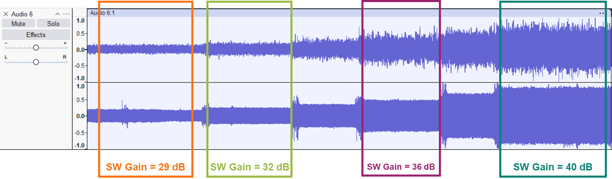


## Key takeaways

- Hardware components like microphones have physical limitations (for example, DC offset) that can significantly impact software performance and audio quality.
- Simply increasing the bit depth (16- to 24-bit) in the hardware peripheral is not a complete solution; the software pipeline **must** be adapted to handle the new, wider data format.
- Moving gain application from hardware (pre-decimation, as in `Cy_PDM_PCM_SetGain()`) to software (post-decimation, as in `Cy_PDM_PCM_ApplyPCM_Gain()`) is a key technique for maximizing usable dynamic range when DC offsets are present. The 24-bit intermediate data provides the necessary headroom to absorb the offset.

## Conclusion

In this lab, we successfully identified a hardware-specific audio artifact (DC-offset-induced clipping) and then engineered a robust solution by reconfiguring the PDM-PCM peripheral for 24-bit capture, incorporating custom FIR filter coefficients, and modifying the software application to use a 24-bit intermediate buffer with software-based gain and conversion. This exercise demonstrates a complete, low-level audio engineering workflow on the PSOC&trade; Edge platform for high-quality audio when external factors like microphone DC offsets vary.

## Lab 2: Hands-on with DEEPCRAFT&trade; Audio Enhancement


## Objective

- To gain hands-on experience with the DEEPCRAFT&trade; Audio Enhancement (AE) pipeline on the PSOC&trade; Edge CM55 core.
- To use the DEEPCRAFT&trade; Audio Enhancement application in Functional mode to observe real-time noise suppression.
- To use the AFE Configurator tool in **Tuning** mode to dynamically modify AE parameters without recompiling.
- To learn two different methods for visualizing the multi-channel debug audio stream.

## Description

This lab uses the DEEPCRAFT&trade; Audio Enhancement Application example, which runs a full, complex audio pipeline on the CM55 core. This pipeline includes PDM capture, DEEPCRAFT&trade; AE processing (with components like Noise Suppression and Acoustic Echo Cancellation), and USB audio streaming (UAC) in both directions.

The lab is divided into three exercises:

1. **Functional mode:** The user will run the default **Functional** mode, play a noisy audio file, and use the onboard USER_BTN1 to toggle the AE noise suppression on and off, observing the result in real-time in Audacity
2. **Tuning mode:** The user will reconfigure the project for **Tuning** mode (CONFIG_AE_MODE=TUNING), connect the powerful AFE Configurator tool via UART, and learn to dynamically disable/enable AE components like **Noise suppression** without recompiling the firmware
3. **Visualization:** The user will learn to visualize the 4-channel debug audio stream available in 'Tuning' mode, using two distinct methods: 
- Configuring Audacity for 4-channel WASAPI capture
- Using the AFE Configurator's built-in recording tool

## DEEPCRAFT&trade; AE pipeline

### Architecture: AFE configurator, AFE middleware, and audio-voice-core

The DEEPCRAFT&trade; Audio Enhancement solution is comprised of three main components:

- **AFE configurator:** A PC-based GUI tool used to configure the entire audio processing pipeline. It generates static configuration files (for example, `cy_afe_configurator_settings.c`) that are compiled into the project. It also provides a real-time tuning interface that communicates with the target over UART.
- **AFE middleware:** This is the firmware component that runs on the PSOC&trade; Edge (specifically the CM55 core). It is responsible for managing the flow of audio data from the PDM peripheral, feeding it to the audio-voice-core library, and sending the processed output to the USB peripheral.
- **Audio-voice-core library:** This is a pre-compiled, licensed library from Infineon that contains the core, high-performance audio processing algorithms themselves (for example, Acoustic eho cancellation (AEC), Beamforming (BF), Noise suppression (NS), Dereverberation).

### Operational modes: functional vs tuning

The AE application example can be configured in one of two modes via the CONFIG_AE_MODE macro in the common.mk file:

- **FUNCTIONAL mode:** This is the default mode, intended for demonstrating the final, deployed application. In this mode, the PSOC&trade; Edge device enumerates as a **mono-channel** USB microphone, streaming only the final processed audio. The USER_BTN1 is enabled to toggle processing ON and OFF.
- **TUNING mode:** This mode is for development, debugging, and tuning. The device enumerates as a **Quad-channel (4-channel)** USB microphone. This allows the AFE Configurator tool to connect via UART and provides a multi-channel stream for debugging internal pipeline stages.

## Hardware diagram

The hardware setup for this lab requires two USB connections and a potential audio loop for full testing.

1. **Host PC:** Runs Audacity, Tera Term (or any other serial terminal), and the AFE Configurator
2. **USB 1 (KitProg3):** Connects to J8. Used for programming, debugging, and **UART communication** with the AFE Configurator
3. **USB 2 (Device USB):** Connects to J30. Used for **UAC audio streaming** (both in and out). See Figure 3 for the location of USB Device port on KIT_PSE84_EVAL
4. **Audio Loop (for AEC):** The PC's audio *output* is routed to the speakers (Audio Control) device. This plays audio *out* of the PSOC&trade; Edge E84 kit's onboard speaker. The PDM microphones capture this speaker audio, which is then cancelled by the AEC algorithm

See [KIT_PSE84_EVAL details](#appendix-b-kit_pse84_eval-details) for more information.

## Audio data flow

The data flow in the Audio Enhancement application is shown below.

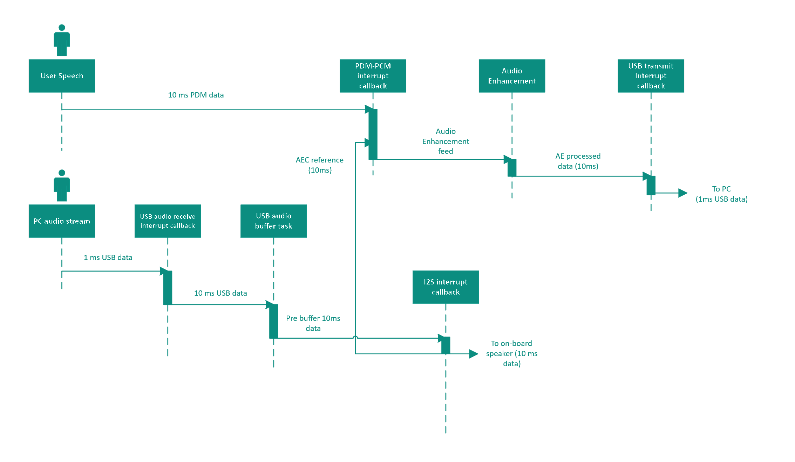

## Project creation

1. Follow steps 1-4 in [Appendix A: Creating a PSOC&trade; Edge application in ModusToolbox&trade;](#appendix-a-creating-a-psoc-edge-application-in-modustoolbox) to create a new application
2. When creating the application, select the **PSOC&trade; Edge DEEPCRAFT&trade; Audio Enhancement** application under the **Audio** section

> **Note:** To prevent issues with Windows path length, it is recommended to rename the project if the workspace path is long.

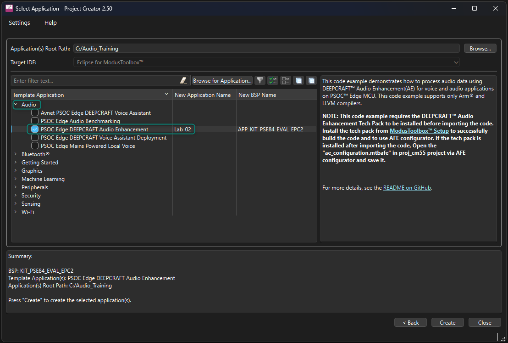


3. [Info] Before building, ensure the LLVM compiler is installed. The lab also requires the **DEEPCRAFT&trade; Audio Enhancement Tech Pack** to be installed (via the ModusToolbox&trade; Setup tool). See [prerequisites](#prerequisites) for more information

4. Build and program the application. The project is in Functional mode by default

## Exercise 1: Real-time Noise Suppression in the functional Mode

### Hardware and software setup

1. Connect **both** USB cables: KitProg3 (J8) and Device USB (J30)
2. On your Host PC, go to *Settings > System > Sound*
3. In the Output section, set your default audio device to **Speakers (Audio Control)**. This will route your PC's audio to the PSOC&trade; Edge E84 kit's speaker
   In the Input section, you should see **Microphone (Audio Control)**. This is the audio from the PSOC&trade; Edge E84 kit.
   
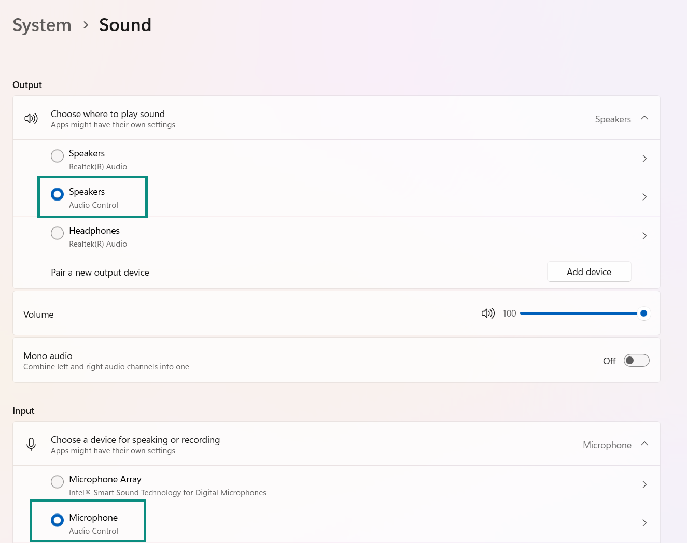


4. Open Audacity. Set the Recording Device to **Microphone (Audio Control)** and Recording Channels to **1 (Mono)**

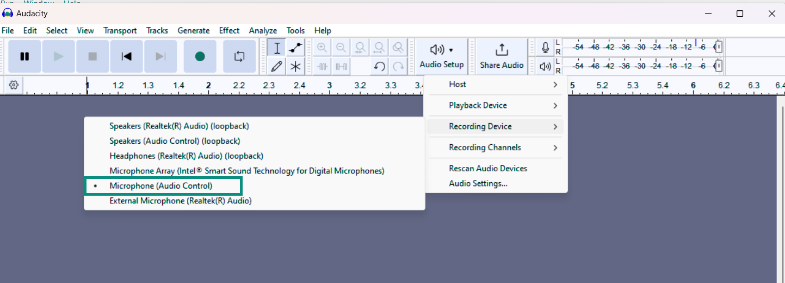


### Using USER_BTN1 to Toggle AE processing

1. Start a source of background noise (for example, play a white noise video on your PC, which will now play from the E84 kit's speaker). You can also use the audio files provided in the `audio_test_data` folder as part of this lab's resources
2. In Audacity, click **Record**. Speak into the PDM microphones
3. Initially, the Blue LED on the kit will be ON. The recorded audio will be clean. The noise (playing from the PC) is largely removed by the Noise Suppression (NS) and Acoustic echo cancellation (AEC) components

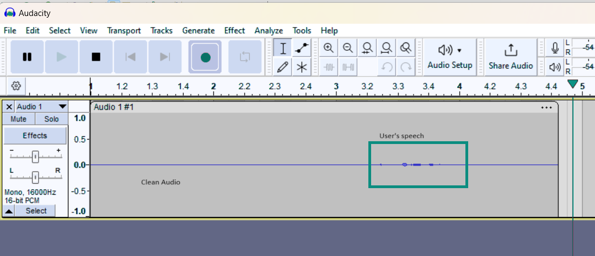


4. Press **USER_BTN1** (the user button on the kit)
5. The Blue LED will turn OFF. The audio recorded in Audacity will instantly become noisy, as you are now capturing the raw, unprocessed audio from the microphones

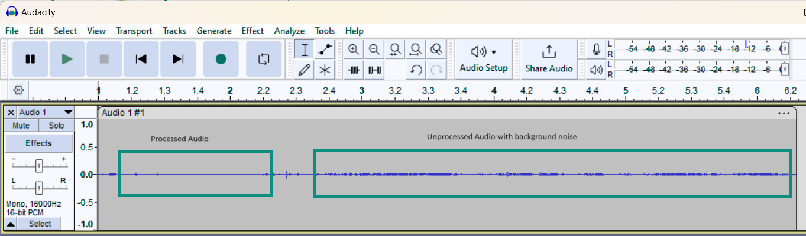


6. Press USER_BTN1 again. The Blue LED will turn ON, and the audio stream will become clean again. This demonstrates the real-time effect of the AFE middleware

## Exercise 2: Real-time tuning with AFE configurator

### Switching to tuning mode

1. In the ModusToolbox&trade; application, open the common.mk file from the root of the AE application project
2. Find the line: `CONFIG_AE_MODE=FUNCTIONAL`
3. Change it to: `CONFIG_AE_MODE=TUNING`
4. Save the file, then build and re-program the board
5. The device will now enumerate as a **4-channel** microphone

### Connecting the AFE configurator

This is a critical, multi-step process that must be followed precisely.

1. Close Tera Term or any other serial terminal application. The AFE Configurator needs exclusive access to the KitProg3 UART port
2. Open the **AFE Configurator** tool from the Quick Panel, under proj_cm55 Library Configurators
> **Note**: AFE Configurator is installed with the DEEPCRAFT&trade; Audio Enhancement Tech Pack mentioned in [prerequisites](#prerequisites).

3. In the AFE Configurator, go to **File > Open** and select the project's AFE configuration file: *proj_cm55/source/audio_enhancement_application/audio_enhancement/ae_configuration.mtbafe*
4. Click the Connect icon in the toolbar (represented by a USB plug). When the  dialog appears, select the COM port corresponding to your **KitProg3 USB-UART** and click OK

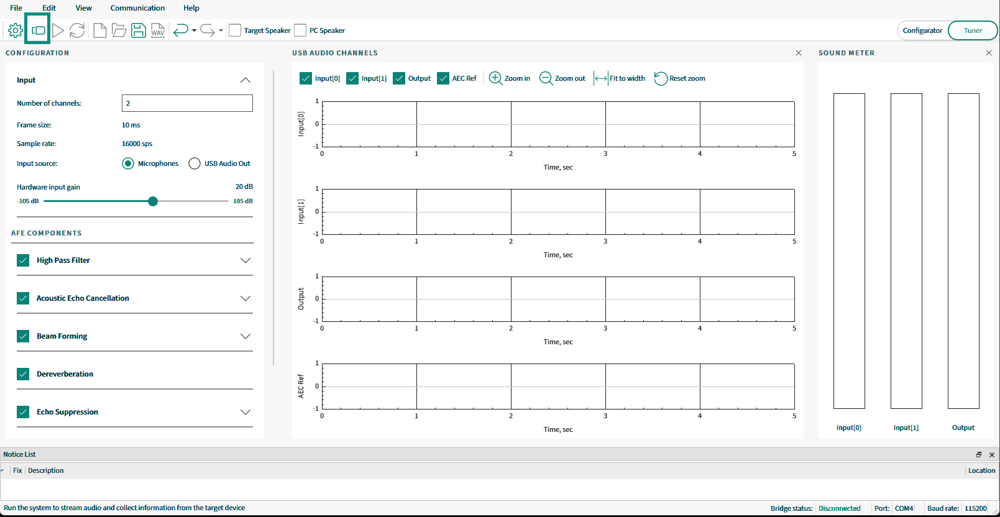


5. Observe the status bar in the bottom-right corner. It should turn green and display **Bridge status: connected**. If it does not, ensure Tera Term is closed and you have the correct COM port

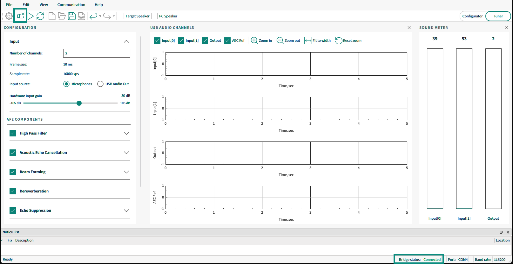


### Dynamically modifying the AE pipeline

1. With the AFE Configurator connected and a noise source playing, open Audacity and start recording with Recording Channels set to '4'. See [Method A: 4-Channel Visualization in Audacity](#method-a-4-channel-visualization-in-audacity) for details on setting up Audacity
2. Listen to the main output channel
3. In the AFE Configurator, on the left-hand pane, find the **Noise Suppression** component, and **uncheck** it
4. Click the **Sync filter settings** button (two arrows button)
5. A **Sync Filter Parameters** window will appear. Click the **Load to device** button

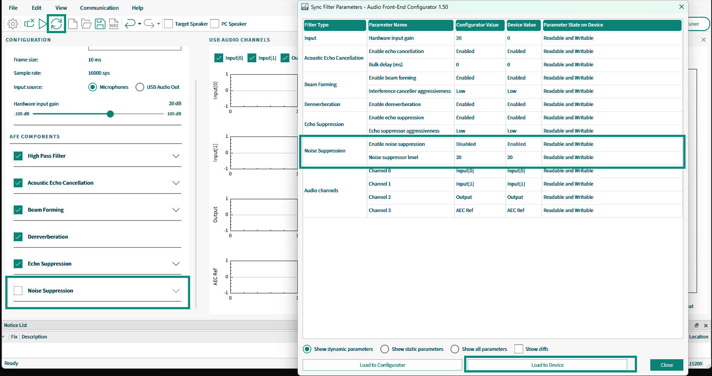


6. You will immediately hear the background noise return in your Audacity recording. The AFE pipeline has been modified in real-time without recompiling
7. Re-check the **Enable noise suppression** box and click **Sync filter settings** -> **Load to device** again to verify the noise suppression returns
8. Explore the other available dynamic parameters

<table>
  <thead>
    <tr>
      <th>Filter type</th>
      <th>Parameter name</th>
    </tr>
  </thead>
  <tbody>
    <tr>
      <td>Input</td>
      <td>Hardware input gain (dB)</td>
    </tr>
    <tr>
      <td rowspan="2">Acoustic Echo Cancellation</td>
      <td>Enable echo cancellation</td>
    </tr>
    <tr>
      <td>Bulk delay (ms)</td>
    </tr>
    <tr>
      <td rowspan="2">Beam Forming</td>
      <td>Enable beam forming</td>
    </tr>
    <tr>
      <td>Interference canceller aggressiveness</td>
    </tr>
    <tr>
      <td>Dereverberation</td>
      <td>Enable dereverberation</td>
    </tr>
    <tr>
      <td rowspan="2">Echo Suppression</td>
      <td>Enable echo suppression</td>
    </tr>
    <tr>
      <td>Echo suppressor aggressiveness</td>
    </tr>
    <tr>
      <td rowspan="2">Noise Suppression</td>
      <td>Enable noise suppression</td>
    </tr>
    <tr>
      <td>Noise suppressor level (dB)</td>
    </tr>
    <tr>
      <td rowspan="4">Audio channels</td>
      <td>Channel 0</td>
    </tr>
    <tr>
      <td>Channel 1</td>
    </tr>
    <tr>
      <td>Channel 2</td>
    </tr>
    <tr>
      <td>Channel 3</td>
    </tr>
  </tbody>
</table>


## Exercise 3: Visualizing the AE pipeline channels

This exercise uses the TUNING mode firmware from the previous step.

### Method A: 4-channel visualization in audacity

1. Open **Audacity**
2. Go to *Edit > Preferences > Devices* (or click the Audio Settings button)
3. Set the Host: to **Windows WASAPI**. This is essential for raw multi-channel capture
4. Set the recording device to **Microphone (2-Audio Control)**
5. Set the recording channel to **4**

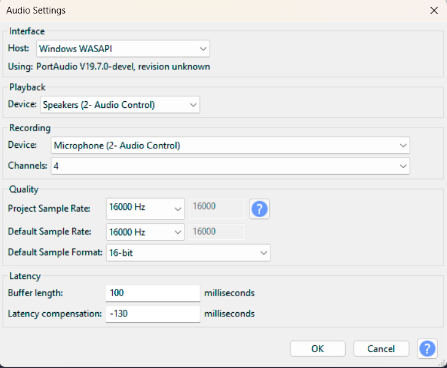


6. In the **AFE Configurator**, click the **Connection Settings** icon (a gear)
7. In the **USB audio input** section, map the four channels to different debug signals. An example setup is as follows:
   - Channel 0: Input (raw audio from left mic)
   - Channel 1: Output (final processed audio)
   - Channel 2: Input (raw audio from right mic)
   - Channel 3: AEC Ref (the audio being played to the board for echo cancellation)

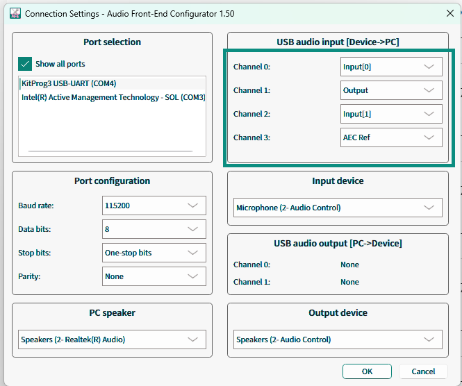


8. Click **OK** in the AFE Configurator. Click **Record** in Audacity
9. Play music on your PC and speak into the microphones
10. You will see four separate audio tracks being recorded simultaneously. You can now visually compare the raw, noisy input (tracks 1 and 3) to the clean, processed output (track 2) and see the AEC Ref (track 4) signal

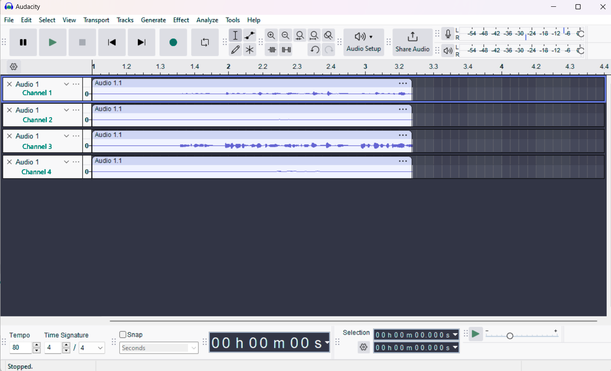


### Method B: Capturing Audio with AFE Configurator

This is an alternative workflow that uses the AFE Configurator's built-in recorder.

1. Ensure you are in TUNING mode and the AFE Configurator is **connected**
2. In the AFE Configurator main window, click the **Play** icon (which acts as a **Record** button for the incoming stream). The tool will begin capturing the 4-channel data


3. Speak or play audio for 5-10 seconds
4. Click the **Stop** icon


The 4-channel recording is shown in the AFE configurator.

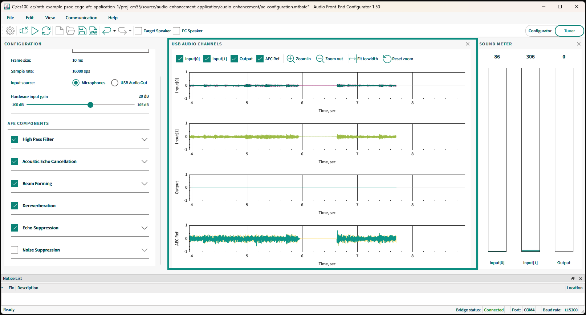


5. Click the **Save recording** icon (floppy disk icon)


6. Save the capture as a .wav file (for example, `my_capture.wav`)
7. Open Audacity. Drag and drop the saved `my_capture.wav` file into the Audacity window
8. Audacity will import the file, showing all four captured channels
9. Select a track, open the track menu, and select **Spectrogram** view. This allows you to visually compare the frequency content of the raw input versus the processed output, providing clear evidence of noise suppression

## Key takeaways

- The AE application demonstrates a sophisticated, dual-mode (FUNCTIONAL/TUNING) development workflow
- The AFE Configurator is a powerful tool for rapid, real-time tuning over UART, which dramatically accelerates development by avoiding the build/flash/test cycle
- TUNING mode's 4-channel USB Audio output is an essential debug feature, allowing direct, simultaneous comparison of raw microphone input (Input), final processed audio (Output), and internal pipeline signals (AEC Ref)
- Proper tool setup is critical for multi-channel analysis; for example, close Tera Term before using the AFE Configurator, and use the Windows WASAPI host in Audacity

## Conclusion

In this lab, we successfully operated the complete DEEPCRAFT&trade; Audio Enhancement pipeline. We used the **Functional mode** to demonstrate the end-user impact of AE processing. More importantly, we used the **Tuning mode** workflow to connect the AFE Configurator, dynamically modify the pipeline's behavior in real-time, and capture the internal multi-channel debug streams for detailed analysis in Audacity. This lab provides the foundational skills for tuning and debugging any audio application built on the DEEPCRAFT&trade; AE platform.

## Appendix A: Creating a PSOC&trade; Edge application in ModusToolbox&trade;

The following steps show how to create a new project for PSOC&trade; Edge in ModusToolbox&trade;.

1. Open the **ModusToolbox&trade; Dashboard** and launch the **Eclipse IDE for ModusToolbox&trade;**
2. If you have not installed ModusToolbox&trade; or Eclipse IDE, see Required development tools section

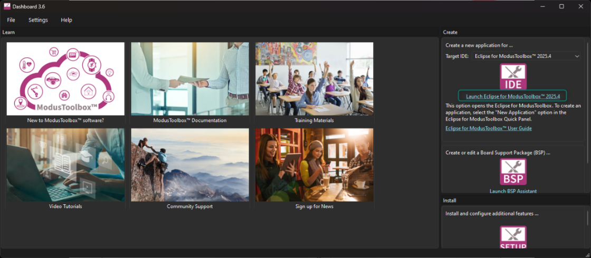


3. Choose a **workspace directory** for your project

A folder is created if the workspace does not exist.

After selecting a suitable directory, click the **Launch** button

> **Note:** It is recommended to keep the workspace path short. Windows has a 260-character path length limit and a long workspace path may cause build issues when creating some applications

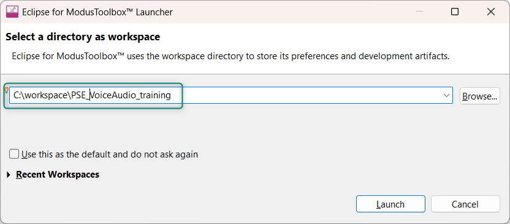


4. Select **New Application** from the Quick Panel. Alternatively, go to **File > New > ModusToolbox&trade;** application. This will launch the **Project Creator Tool**

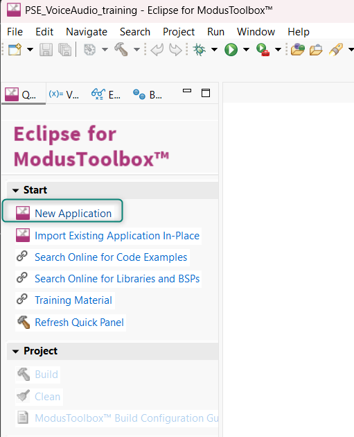


5. Once **Project Creator** launches, you will be prompted to select a board support package (BSP). Select the **KIT_PSE84_EVAL_EPC2 BSP** under the PSOC&trade; Edge BSPs and click **Next**

> **Note:** BSPs are aligned with our development/evaluation kits; they provide files for basic device functionality. A BSP typically has a* *design.modus* file that configures clocks and other board-specific capabilities. That file is used by the ModusToolbox&trade; configurators. A BSP also includes the required device support code for the device on the board. You can modify the configuration to suit your application.

> **Note:** Observe that ModusToolbox&trade; also includes BSPs for PSOC&trade; Edge EPC4 devices (`KIT_PSE84_EVAL_EPC4`), and for the PSOC&trade; Edge AI Kit (`KIT_PSE84_AI`). However, this training is intended to be used with the `KIT_PSE84_EVAL` which includes EPC2 devices by default.

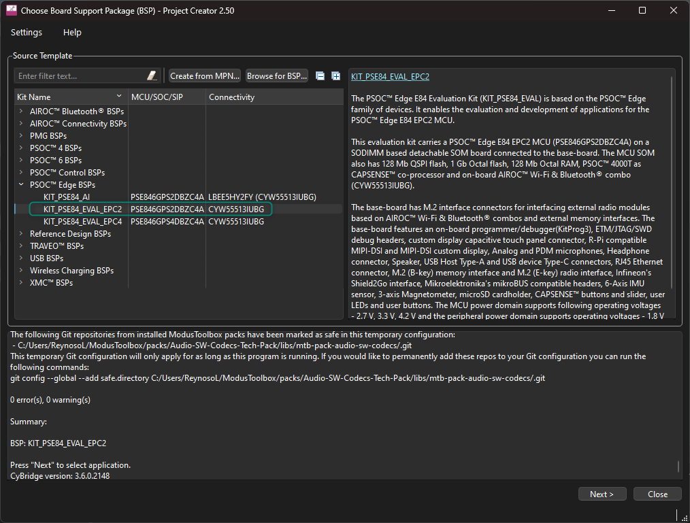


6. A new window opens to select an application. The Project Creator includes categories and a search field to make it easier to find and select different examples

Click the **checkbox** near the application, optionally rename the project, and click **Create**.

The figure below shows the creation of the **PSOC&trade; Edge Hello World** application under the **Getting Started section**.

> **Note:** Windows has a 260-character path length limit. A long workspace path and/or a long project name may cause build issues when creating some applications.

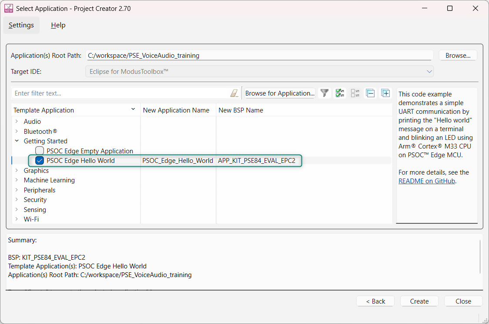


7. A new project is created, and you can see all the files in the Project Explorer window

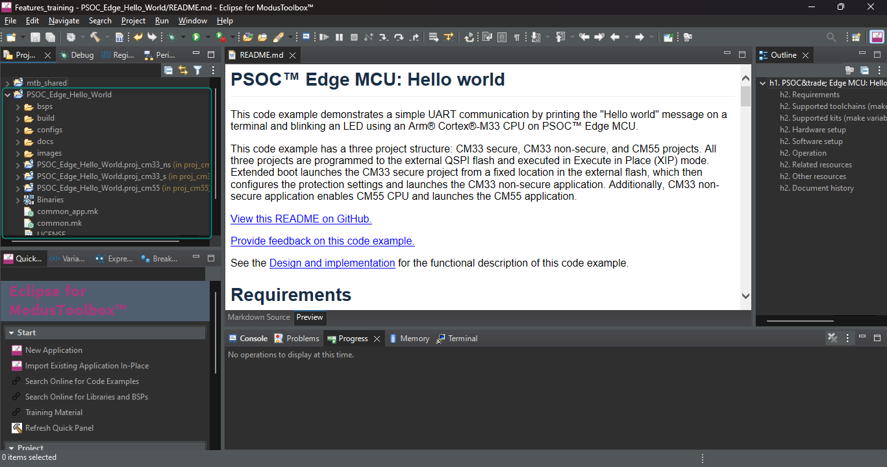


## Appendix B: KIT_PSE84_EVAL details


| No. | Item | No. | Item |
| ---: | --- | ---: | --- |
| 1 | Baseboard power LED (D1) | 26 | 3-axis magnetometer (U4) |
| 2 | KitProg3 program/debug USB-C connector (J8) | 27 | Raspberry Pi-compatible display capacitive touch connector (J41)** |
| 3 | PSOC&trade; 5LP-based KitProg3 programmer and debugger (CY8C5868LTI-LP039, U2) | 28 | Linear potentiometer (R34) |
| 4 | Reset button (SW1) | 29 | Analog microphones (IM73A135V01XTSA1, U36 and U37)** |
| 5 | KitProg3 status LED (D2) | 30 | User LEDs (D3, D4, D5) |
| 6 | PSOC&trade; Edge E84 MCU ETM/JTAG debug and trace header (J15) | 31 | Thermistor (TH1) |
| 7 | PSOC&trade; Edge E84 MCU 10-pin SWD/JTAG program and debug header (J16) | 32 | CAPSENSE&trade; buttons and slider (CSB1, CSB2, CSS1) |
| 8 | Alternative serial interface configuration headers (J20, J21) | 33 | BOOT configuration switch (SW6) |
| 9 | PSOC&trade; Edge E84 MCU USB host Type-A connector (J27) | 34 | Proximity sense connector (J19) |
| 10 | USB-C power delivery (PD) fault LED (D6) | 35 | I/O headers compatible with Arduino UNO R3 (J2, J3, J4) |
| 11 | Custom display capacitive touch panel connector (J37)** | 36 | Alternative serial interface I/O header (J14)* |
| 12 | PSOC&trade; Edge E84 MCU USB-C connector (J30) | 37 | Power header compatible with Arduino UNO R3 (J1) |
| 13 | External power supply VIN connector (J31) | 38 | PSOC&trade; Edge E84 MCU expansion I/O headers (J6, J7, J40)* |
| 14 | PSOC&trade; Edge E84 MCU user buttons (SW2, SW4) | 39 | MicroSD card holder (J35)** |
| 15 | M.2 (B-key) memory interface connector (J29) | 40 | Infineon's Shield2Go interface headers (J10, J12)* |
| 16 | 128 Mbit Octal-SPI HYPERRAM&trade; (S70KS1283GABHI020, U12)*** | 41 | PDM microphones (IM72D128V01XTMA1, U7 and U8)** |
| 17 | Processor System on module (SoM) 260-pin SODIMM connector (J28) | 42 | mikroBUS compatible headers by Mikroelektronika (J9, J17)* |
| 18 | CYW55513 tri-band (Wi-Fi & Bluetooth&reg;) combo radio (U3) section | 43 | Extended I2S header (J11)* |
| 19 | Processor System on module (SoM) power LED (D3) | 44 | 6-axis accelerometer and gyroscope IMU (U5) |
| 20 | 1-Gb Octal-SPI NOR flash (S28HS01GTGZBH1030, U10)*** | 45 | M.2 (E-key) radio interface connector (J13) |
| 21 | 128-Mb Quad-SPI NOR flash (S25FS128SAGMFB100, U11) | 46 | PSOC&trade; Edge E84 MCU power selection/monitoring headers (J18, J22, J23, J24, J25, J26) |
| 22 | MIPI-DSI custom display connector (J38)** | 47 | Headphone connector (J34)* |
| 23 | PSOC&trade; Edge E84 MCU (PSE846GPS2DBZC4A, U1) | 48 | Speaker (ACC6) |
| 24 | PSOC&trade; 4000T CAPSENSE&trade; Co-processor (U9)*** | 49 | RJ45 Ethernet MagJack connector (J5)* |
| 25 | Raspberry Pi-compatible MIPI-DSI display connector (J39)** | 50 | KitProg3 programming mode selection button (SW3) |

\*Footprint only, not populated on the board

\*\*Component at the bottom side of the Baseboard

\*\*\*Component at the bottom side of the SoM

## Revision history

<table class="no-center-table">
    <thead>
        <tr>
            <th>Document revision</th>
            <th>Date</th>
            <th>Description of changes</th>
        </tr>
    </thead>
    <tbody>
        <tr>
            <td>**</td>
            <td>2026-08-14</td>
            <td>Initial release.</td>
        </tr>
    </tbody>
</table>

### Disclaimer
All referenced product or service names and trademarks are the property of their respective owners.

The Bluetooth&reg; word mark and logos are registered trademarks owned by Bluetooth SIG, Inc., and any use of such marks by Infineon is under license.

PSOC&trade;, formerly known as PSoC&trade;, is a trademark of Infineon Technologies. Any references to PSoC&trade; in this document or others shall be deemed to refer to PSOC&trade;.

---------------------------------------------------------

© Cypress Semiconductor Corporation, 2023-2026. This document is the property of Cypress Semiconductor Corporation, an Infineon Technologies company, and its affiliates ("Cypress").  This document, including any software or firmware included or referenced in this document ("Software"), is owned by Cypress under the intellectual property laws and treaties of the United States and other countries worldwide.  Cypress reserves all rights under such laws and treaties and does not, except as specifically stated in this paragraph, grant any license under its patents, copyrights, trademarks, or other intellectual property rights.  If the Software is not accompanied by a license agreement and you do not otherwise have a written agreement with Cypress governing the use of the Software, then Cypress hereby grants you a personal, non-exclusive, nontransferable license (without the right to sublicense) (1) under its copyright rights in the Software (a) for Software provided in source code form, to modify and reproduce the Software solely for use with Cypress hardware products, only internally within your organization, and (b) to distribute the Software in binary code form externally to end users (either directly or indirectly through resellers and distributors), solely for use on Cypress hardware product units, and (2) under those claims of Cypress's patents that are infringed by the Software (as provided by Cypress, unmodified) to make, use, distribute, and import the Software solely for use with Cypress hardware products.  Any other use, reproduction, modification, translation, or compilation of the Software is prohibited.
<br>
TO THE EXTENT PERMITTED BY APPLICABLE LAW, CYPRESS MAKES NO WARRANTY OF ANY KIND, EXPRESS OR IMPLIED, WITH REGARD TO THIS DOCUMENT OR ANY SOFTWARE OR ACCOMPANYING HARDWARE, INCLUDING, BUT NOT LIMITED TO, THE IMPLIED WARRANTIES OF MERCHANTABILITY AND FITNESS FOR A PARTICULAR PURPOSE.  No computing device can be absolutely secure.  Therefore, despite security measures implemented in Cypress hardware or software products, Cypress shall have no liability arising out of any security breach, such as unauthorized access to or use of a Cypress product. CYPRESS DOES NOT REPRESENT, WARRANT, OR GUARANTEE THAT CYPRESS PRODUCTS, OR SYSTEMS CREATED USING CYPRESS PRODUCTS, WILL BE FREE FROM CORRUPTION, ATTACK, VIRUSES, INTERFERENCE, HACKING, DATA LOSS OR THEFT, OR OTHER SECURITY INTRUSION (collectively, "Security Breach").  Cypress disclaims any liability relating to any Security Breach, and you shall and hereby do release Cypress from any claim, damage, or other liability arising from any Security Breach.  In addition, the products described in these materials may contain design defects or errors known as errata which may cause the product to deviate from published specifications. To the extent permitted by applicable law, Cypress reserves the right to make changes to this document without further notice. Cypress does not assume any liability arising out of the application or use of any product or circuit described in this document. Any information provided in this document, including any sample design information or programming code, is provided only for reference purposes.  It is the responsibility of the user of this document to properly design, program, and test the functionality and safety of any application made of this information and any resulting product.  "High-Risk Device" means any device or system whose failure could cause personal injury, death, or property damage.  Examples of High-Risk Devices are weapons, nuclear installations, surgical implants, and other medical devices.  "Critical Component" means any component of a High-Risk Device whose failure to perform can be reasonably expected to cause, directly or indirectly, the failure of the High-Risk Device, or to affect its safety or effectiveness.  Cypress is not liable, in whole or in part, and you shall and hereby do release Cypress from any claim, damage, or other liability arising from any use of a Cypress product as a Critical Component in a High-Risk Device. You shall indemnify and hold Cypress, including its affiliates, and its directors, officers, employees, agents, distributors, and assigns harmless from and against all claims, costs, damages, and expenses, arising out of any claim, including claims for product liability, personal injury or death, or property damage arising from any use of a Cypress product as a Critical Component in a High-Risk Device. Cypress products are not intended or authorized for use as a Critical Component in any High-Risk Device except to the limited extent that (i) Cypress's published data sheet for the product explicitly states Cypress has qualified the product for use in a specific High-Risk Device, or (ii) Cypress has given you advance written authorization to use the product as a Critical Component in the specific High-Risk Device and you have signed a separate indemnification agreement.
<br>
Cypress, the Cypress logo, and combinations thereof, ModusToolbox, PSoC, CAPSENSE, EZ-USB, F-RAM, and TRAVEO are trademarks or registered trademarks of Cypress or a subsidiary of Cypress in the United States or in other countries. For a more complete list of Cypress trademarks, visit www.infineon.com. Other names and brands may be claimed as property of their respective owners.

<span id="lab-2-hands-on-with-deepcraft-audio-enhancement"></span>

<span id="appendix-a-creating-a-psoc-edge-application-in-modustoolbox"></span>